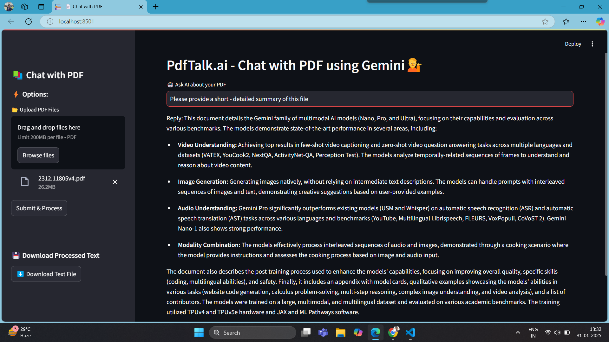

# PdfTalk.Ai

📄 Chat with PDF using Gemini AI
A Streamlit-based AI chatbot that allows users to upload PDFs, extract text, and chat with AI to get answers based on the document content. It leverages Google Gemini AI, FAISS for vector storage, and LangChain for text processing.
🚀 Features
✅ Upload multiple PDF files and extract text
✅ Chunking & Vector Search using LangChain & FAISS
✅ AI-powered responses via Google Gemini 1.5 flash
✅ Modern UI with Streamlit & sidebar enhancements
✅ Download processed text after extraction

🛠️ Tech Stack Used
Python 
Streamlit (Frontend UI)
PyPDF2 (PDF text extraction)
LangChain (Text chunking & processing)
FAISS (Vector search for document retrieval)
Google Generative AI (Gemini 1.5 flash) (AI-powered responses)
dotenv (Environment variable management)

  

📌 Future Enhancements
🔹 Support for DOCX & TXT file uploads
🔹 Improve AI accuracy with context-aware retrieval
🔹 Add chat memory for better conversation flow

